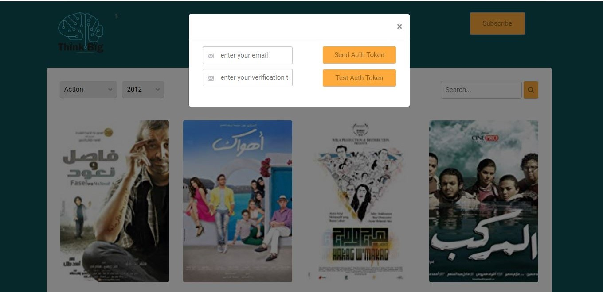
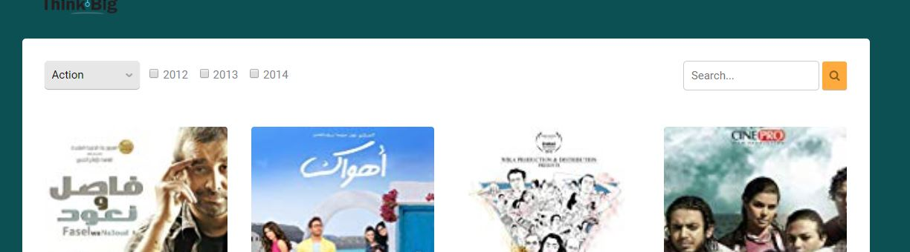

*Changes:
  1 - I put the form which was in the header in a Modal that is displayed when the "Subscripe" button is clicked.
 
  2 - added a property to the "movie-title" class in css to enforce the text to be in one line.
  3 - changed years list to be inline checkboxes instead of drop-down list.
 
